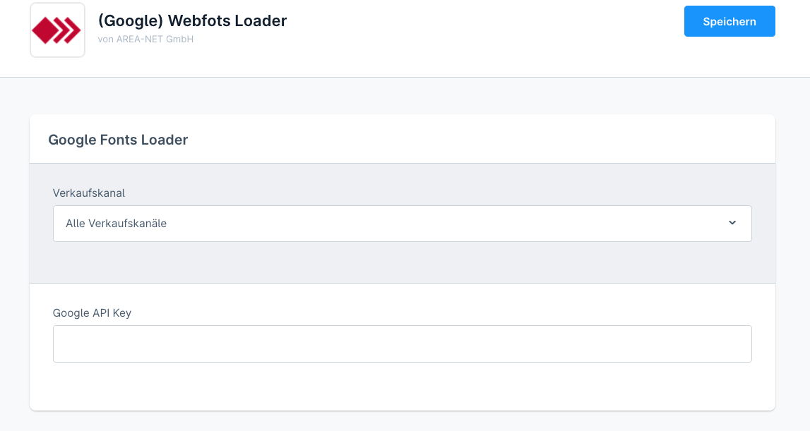
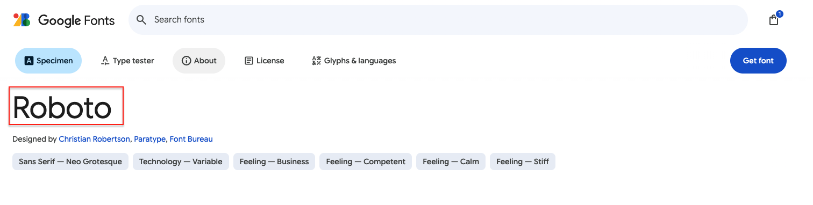
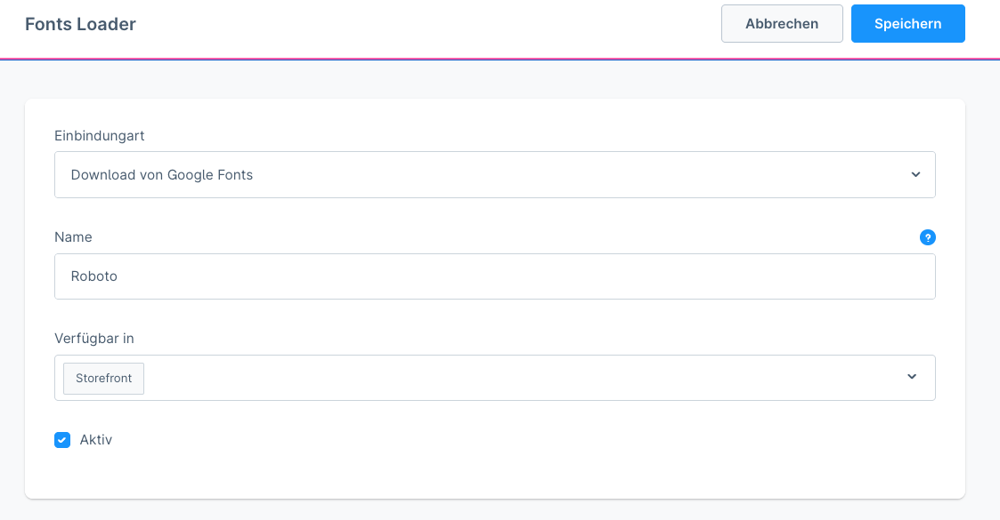
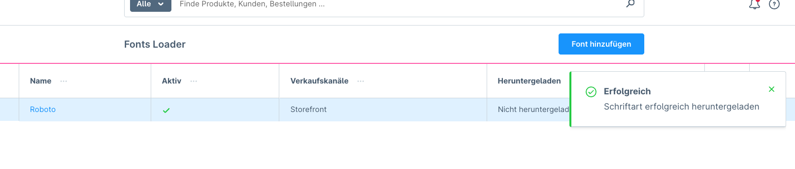
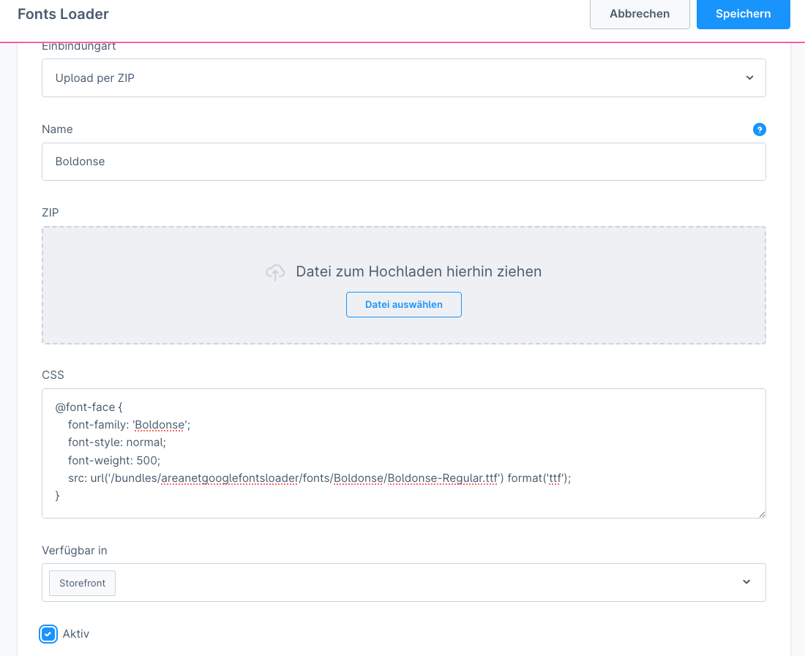
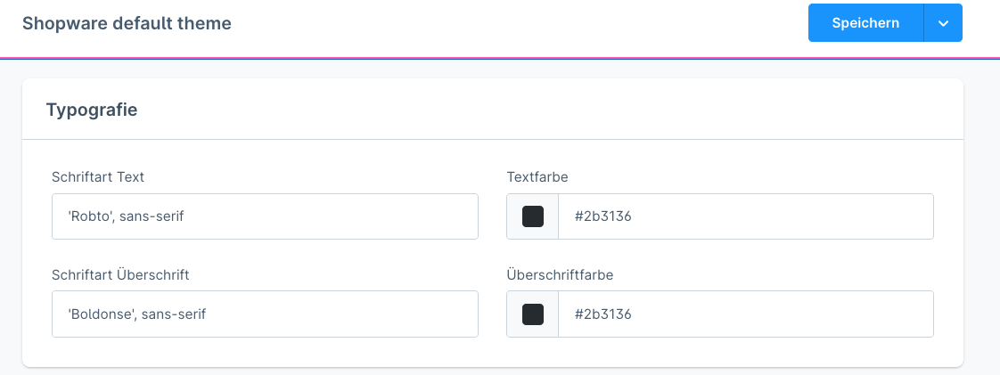

# Shopware 6 Plugin: (Google) Webfonts Loader

# Google Webfonts und eigene Webfonts datenschutzkonform (DSGVO) nutzen

Ermöglicht das Laden von Google Webfonts mit lokaler Speicherung auf dem Server direkt über die Google Fonts API oder 
Upload von eigenen Webfonts per ZIP-Archiv. Die Webfonts können dann direkt in den Theme-Einstellungen oder 
über CSS verwendet werden.

**Die Webfonts werden auf den eigenen Server geladen und sind somit datenschutzkonform nutzbar.**

## Google API Key
Für den automatischen Download von Google Webfonts wird ein kostenloser Google API key benötigt.

- [So erstellst du einen Google API Key](docs/google-api-key.md)
- Der Google API Key wird nur einmalig für den Download der Webdonts benötigt und kann theoretisch danach wieder aus der Pluginkonfiguration entfernt werden.

## Unterstützte Shopware Versionen und Changelog

Stand 27.03.2025:
- **6.6.0 - 6.6.10.2**
- [CHANGELOG](CHANGELOG.md)
- [Download](https://github.com/AREA-NET-GmbH-Shopware-Agentur/shopware6-plugin-google-fonts-loader/releases)

## Installation

### ZIP-Release

Download des entsprechenden ZIP-Files von der [Release-Seite](https://github.com/AREA-NET-GmbH-Shopware-Agentur/shopware6-plugin-google-fonts-loader/releases) und Installation/Upload in der Shopware-Administration unter Erweiterungen.

### Composer

`composer require areanet/google-fonts-loader`

# Dokumentation

## Google Webfonts laden

(1) Google [API-Key](docs/google-api-key.md) in der Pluginkonfiguration hinterlegen:



(2) Die gewünschte Google Webfont unter  https://fonts.google.com/ suchen und den Namen kopieren:



(3) Unter _Inhalte->Fonts Loader_ eine neue _Font hinzufügen_, den Namen der Google Webfont eintragen und die 
gewünschten Verkaufskanäle auswählen, zu denen die Google Webfont hinzugefügt werden soll:



(2) Die Webfont wird im Hintergrund auf den eigenen Server geladen werden und kann im Anschluss genutzt werden:



## Eigene Webfonts per ZIP-Archiv laden

(1) Unter Inhalte->Fonts Loader eine neue "Font hinzufügen" und den Namen der  Schriftart eintragen, das entsprechende ZIP-File 
und die gewünschten Verkaufskanäle auswählen, zu denen die  Webfont hinzugefügt werden soll.

(2) Bei lokalen Webfonts müssen die entsprechenden CSS-Anweisungen angegeben werden. Das ZIP-File wird 1:1 auf den Server
in das Verzeichnis _bundles/areanetgooglefontsloader/fonts/_ entpackt. Entsprechend müssen die Pfade zu den Webfonts korrekt
(mit z.B. Unterordner) angegeben werden.

Beispiel:
```
@font-face {
  font-family: 'Boldonse';
  font-style: normal;
  font-weight: normal;
  src: url('/bundles/areanetgooglefontsloader/fonts/Boldonse/Boldonse-Regular.ttf') format('ttf');
}
```



# Webfonts verwenden

Nachdem die (Google) Webfonts geladen wurden, können sie in den Theme-Einstellungen oder direkt per CSS
datenschutzkonform verwendet werden.



## Support

Wir bieten zu unseren Open-Source-Plugins kostenpflichtigen Support and

* [Online-Formular](https://www.area-net.de/kontakt)
* [shopware@area-net.de](mailto:shopware@area-net.de)

## Shopware Theme und Plugins

Neben kostenlosen Open-Source Shopware-Plugins bietet die Shopware-Agentur auch Themes und Plugins im Shopware-Store an:

- [aloha Theme](https://store.shopware.com/en/arean62788672693m/a-better-cms-theme-optimized-checkout-b2b-functions-flexibly-customizable.html) mit optimiertem Checkout
- [aloha CMS Elements](https://store.shopware.com/arean13931131788m/a-better-cms-elements-slider-bilder-html5-video-google-maps-vorher-nachher-bilder.html) mit umfangreichen Erweiterungen der Standard-Inhaltselemente
- [Pagespeed Booster](https://store.shopware.com/arean41766445685m/pagespeed-booster-paypal-und-externe-skripte-auf-der-startseite-deaktivieren.html) deaktiviert PayPal und Co. auf der Startseite
- [Optimierte Inhaltsbearbeitung](https://store.shopware.com/arean36129443353f/optimierte-inhaltsbearbeitung-inhalte-nur-im-designer-bearbeiten-inhalte-in-layout-uebertragen.html) für CMS-Seiten und Kategorien
- [HTTP-Auth](https://store.shopware.com/arean97586892435f/http-authentifizierung-fuer-verkaufskanaele.html) für Verkaufskanäle

## AREA-NET GmbH
Die AREA-NET GmbH ist Shopware Partner Agentur und Shopware Hersteller, sowie Pickware Partner aus dem Großraum Stuttgart in Baden-Württemberg/Deutschland.

**Adresse**\
Öschstrasse 33\
73072 Donzdorf

Telefon: +49 (0)7162 - 941140\
Mail: [shopware@area-net.de](mailto:shopware@area-net.de)\
Web: [www.area-net.de](https://www.area-net)

Mehr Informationen, Projektanfragen und Support gibt es auf der Website der [Shopware-Agentur AREA-NET GmbH](https://www.area-net.de).

**Follow us**

- https://linkedin.com/companyarea-net-gmbh-shopware-agentur
- https://www.facebook.com/area.net.gmbh

